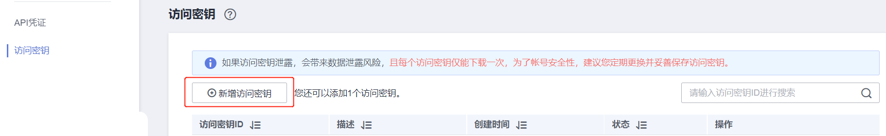
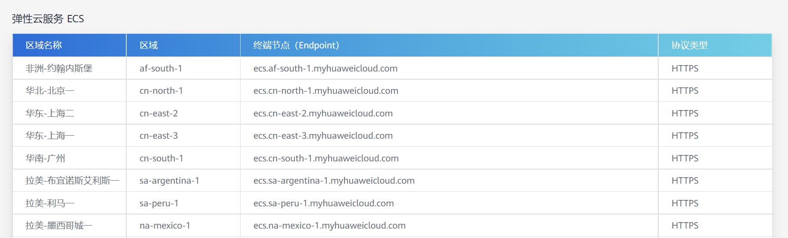
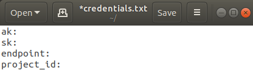
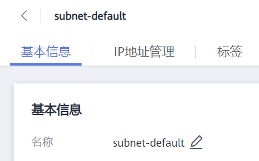
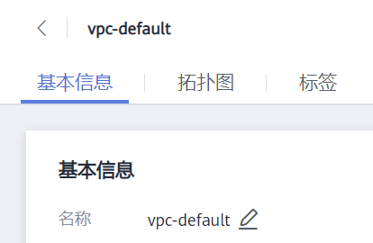

# Experiment HuaweiCloud Deploy

使用华为云node.js SDK部署app到华为云弹性云服务器上。

## 本地部署目标项目到服务器上

### 环境准备

1.安装node.js，并确认是否安装成功：

```
node --version
npm --version
```

2.安装python，并确认是否安装成功：

```
pip3 --version
```

3.将本仓库由git clone下载到本地后，安装第三方包：

```
npm install
pip3 install paramiko
```

### 目标部署项目的存放

1.将目标部署项目编译后得到的可执行文件及相关依赖库放至app文件夹中。

2.修改config文件夹中名为run.sh的shell脚本，export所需环境变量以及项目运行入口（即运行项目的可执行文件）。

### 华为云设置

#### 创建密钥对

1.注册华为云账号，进入安全与合规->数据加密服务->密钥管理，创建密钥对。


2.密钥对名称填写为KeyPair。


3.将KeyPair.pem文件保存至“~/”目录。

#### 创建AK/SK访问密钥

进入我的凭证->访问密钥，创建AK/SK密钥，下载私钥文件。



#### 创建credentials.txt文件

1.查询项目ID：进入我的凭证->API凭证，查询所在区域的项目ID。


2.查询终端节点：https://developer.huaweicloud.com/intl/zh-cn/endpoint



3.在“~/”目录创建credentials.txt文件，填写AK/SK密钥、终端节点、项目ID。



### 项目部署

#### 实例参数

在config/instanceParams.json中填写实例参数，主要参数为：

- count：购买并开启的服务器数量

- flavorRef：待创建云服务器的系统规格的ID

- imageRef：待创建云服务器的系统镜像的ID

- name：云服务器名称

- key_name：使用SSH密钥方式登录云服务器，需指定已创建密钥的名称

- subnet_id：待创建云服务器所在的子网信息，可使用：

  

- iptype：为待创建服务器分配的弹性IP的地址类型

- bandwidth：弹性IP地址带宽参数

- data_volumes：云服务器对应数据盘相关配置，包括磁盘类型和大小

- root_volume：云服务器对应系统盘相关配置

- vpcid：待创建云服务器所属虚拟私有云(VPC)的ID，可使用：

  

详细参数设置可查询：https://support.huaweicloud.com/intl/zh-cn/api-ecs/zh-cn_topic_0020212668.html

#### 项目部署

注意：执行每一条指令都先要等待完成，再执行下一步指令。

1.在华为云上部署一个或多个ECS实例：

```
node deploy
```

2.将app文件夹上传到ECS实例：

```
node upload
```

3.将本地run.sh在ECS实例上运行，以运行app：

```
node run
```

4.通过华为云控制台远程登录ECS实例，查看项目是否运行。